# Screenshots

Generated with `make screenshots` using [freeze](https://github.com/charmbracelet/freeze).

## Basic

| Screenshot | Description |
|------------|-------------|
| 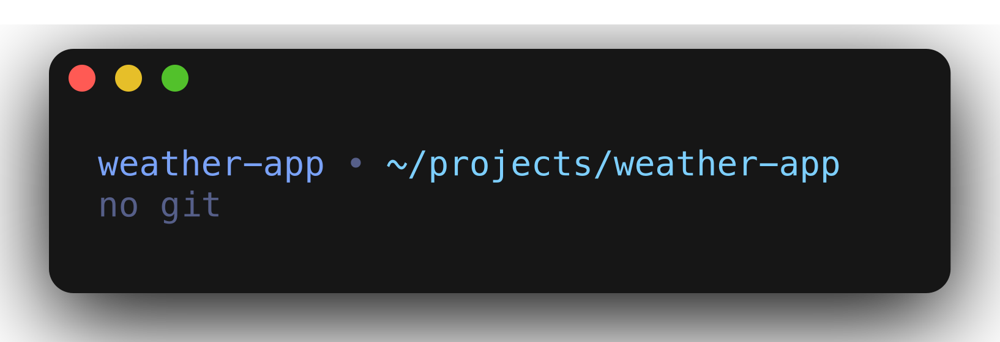 | No git repository |
| 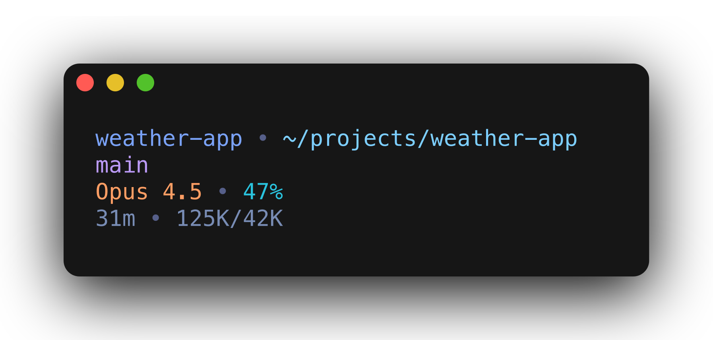 | Git branch only |
| 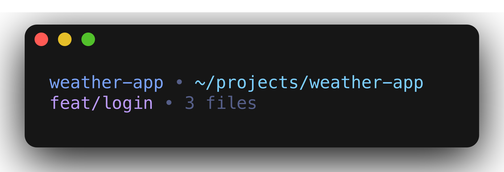 | With changed files |
| 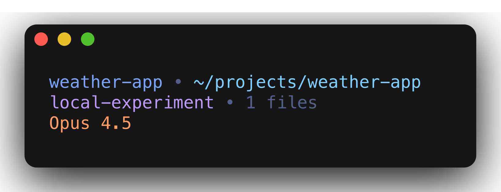 | Local branch (no remote) |

## Ahead/Behind

| Screenshot | Description |
|------------|-------------|
| 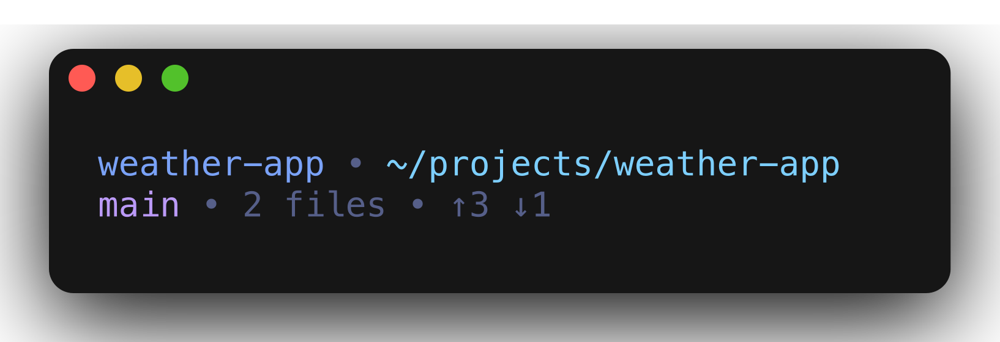 | Ahead and behind remote |
| 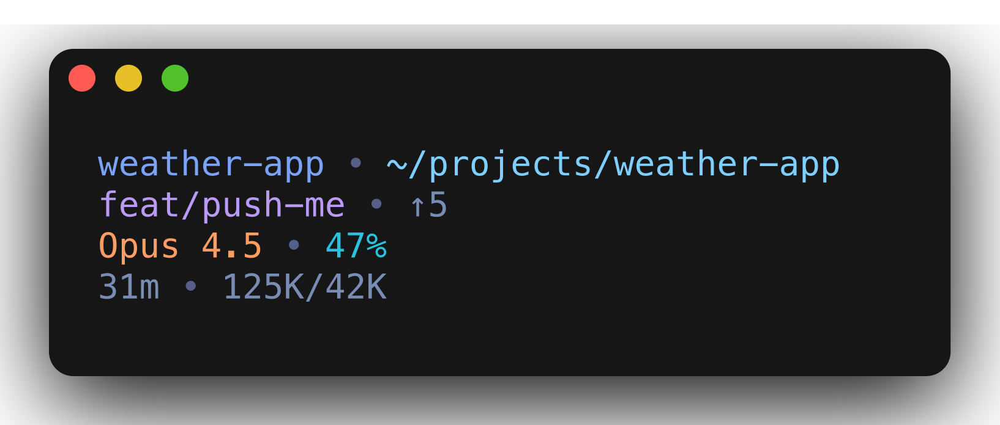 | Ahead of remote |
| 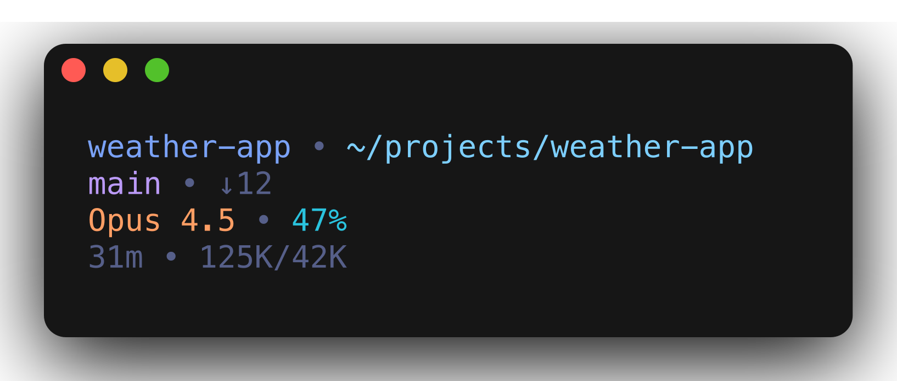 | Behind remote |

## Advanced Git

| Screenshot | Description |
|------------|-------------|
| 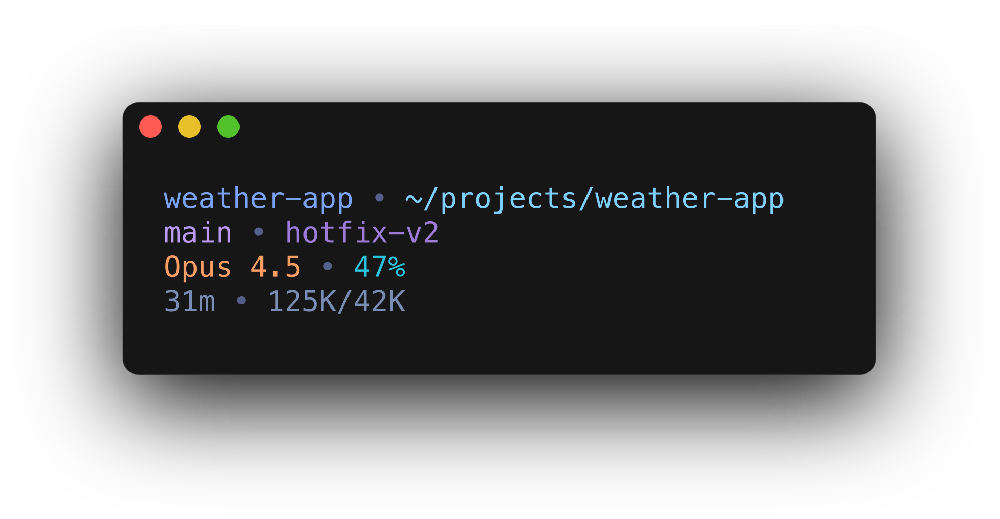 | Git worktree |
| 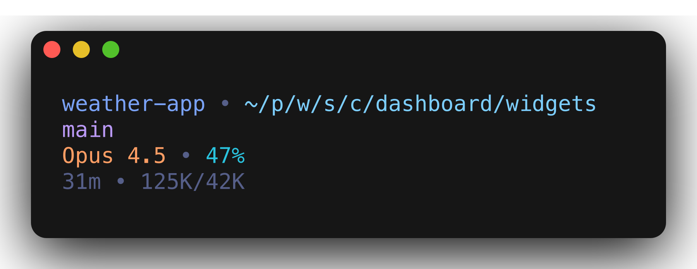 | Fish-style abbreviated path |

## Pull Requests

| Screenshot | Description |
|------------|-------------|
| 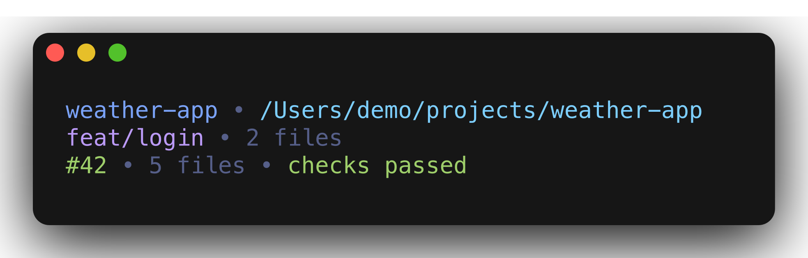 | Open PR, checks passed |
| 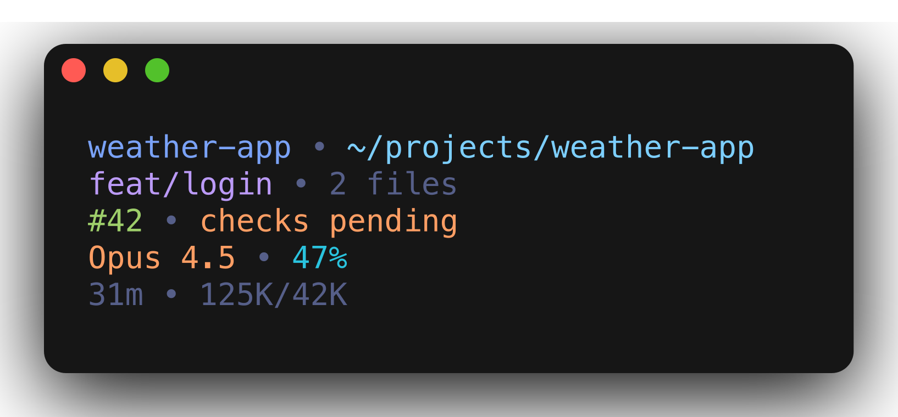 | Open PR, checks pending |
| 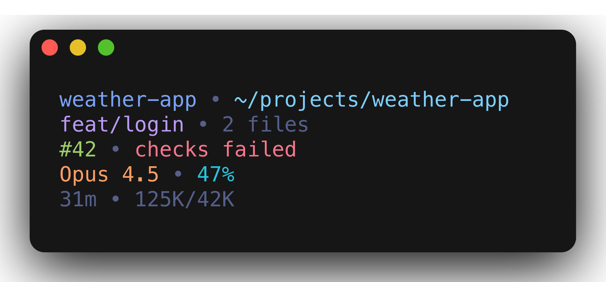 | Open PR, checks failed |
| 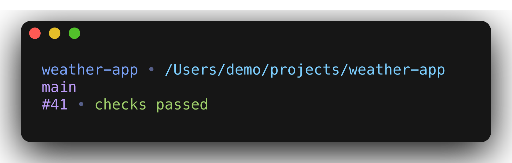 | Merged PR |
| 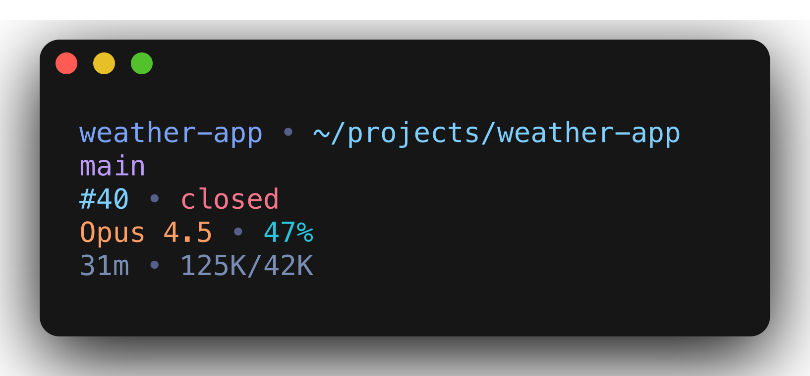 | Closed PR |

## Full Examples

| Screenshot | Description |
|------------|-------------|
| 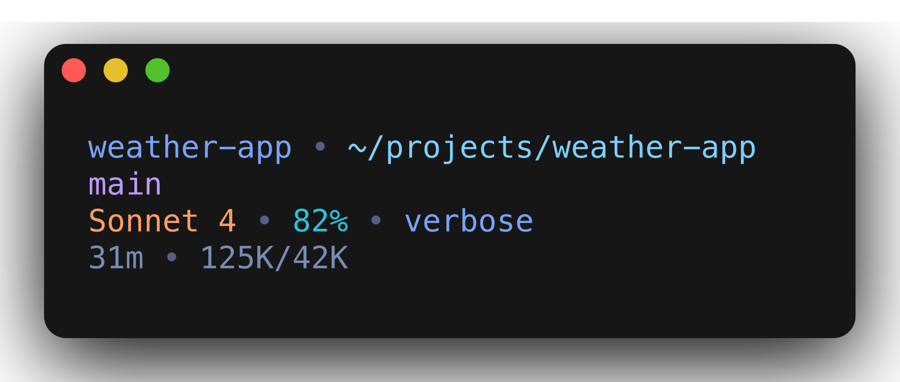 | With output style |
| 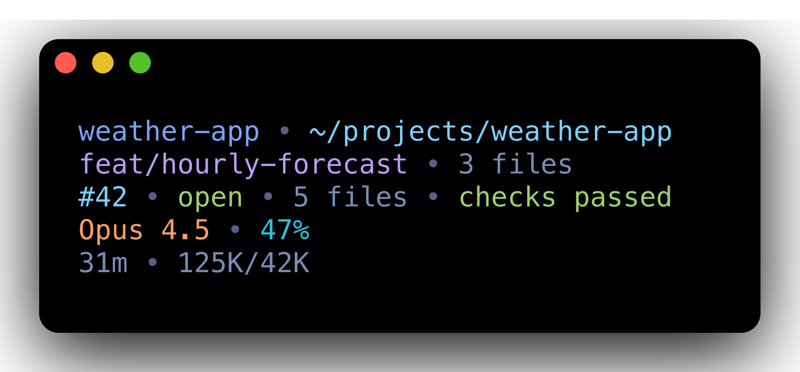 | Full status line |
